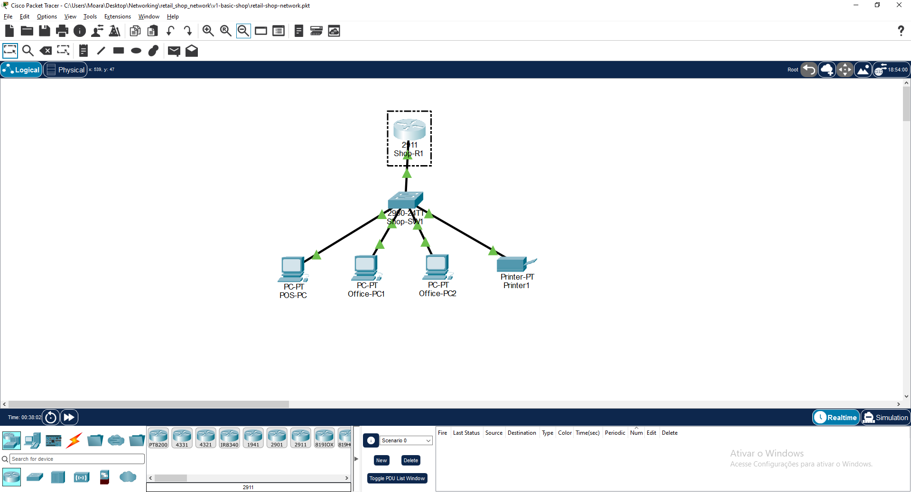

# v1 - Basic Shop Network

The first version of my retail shop network, built in Cisco Packet Tracer.
One router, one switch, three end devices and a printer, all on a single LAN with static IP addresses.

## What I built

- 1 router (Cisco 2911): `Shop-R1`
- 1 switch (Cisco 2960): `Shop-SW1`
- 3 PCs: `POS-PC`, `Office-PC1`, `Office-PC2`
- 1 printer: `Printer1`
- Copper straight-through cables between different device types

## IP addressing plan

Network: `192.168.1.0/24` (mask `255.255.255.0`)

| Device | Connected to | IP address | Default gateway |
|---|---|---|---|
| Shop-R1 (Gi0/0) | Shop-SW1 Gi0/1 | 192.168.1.1 | none |
| POS-PC | Shop-SW1 Fa0/1 | 192.168.1.10 | 192.168.1.1 |
| Office-PC1 | Shop-SW1 Fa0/2 | 192.168.1.20 | 192.168.1.1 |
| Office-PC2 | Shop-SW1 Fa0/3 | 192.168.1.21 | 192.168.1.1 |
| Printer1 | Shop-SW1 Fa0/4 | 192.168.1.30 | 192.168.1.1 |

The gaps between addresses are on purpose, so I can group devices by type and add more later:
`.1` router, `.10-.19` POS devices, `.20-.29` office PCs, `.30-.39` printers.

## Configuration

Router config: [configs/Shop-R1.txt](configs/Shop-R1.txt)

The switch uses its default configuration in this version.

## What I tested

From `POS-PC`, I pinged:

- 192.168.1.1 (router): 0% loss
- 192.168.1.20 (Office-PC1): 0% loss
- 192.168.1.21 (Office-PC2): 0% loss
- 192.168.1.30 (Printer1): 0% loss

## What I learned

- How to choose cable types (straight-through for different device types)
- How to read port names like `Gi0/0` and `Fa0/1` (slot/port)
- Router ports are off by default and need `no shutdown`
- How an IP address, subnet mask and default gateway work together
- Why a device pings its gateway first when testing a network

## Problems I hit and how I fixed them

**Ping returned "Destination host unreachable"**
I pinged `192.162.1.20` by mistake instead of `192.168.1.20`. The reply came from the gateway (`192.168.1.1`), which told me the address was outside my network. Fixed by correcting the typo.

## What's next

v2: add DHCP and a wireless access point for guests.
